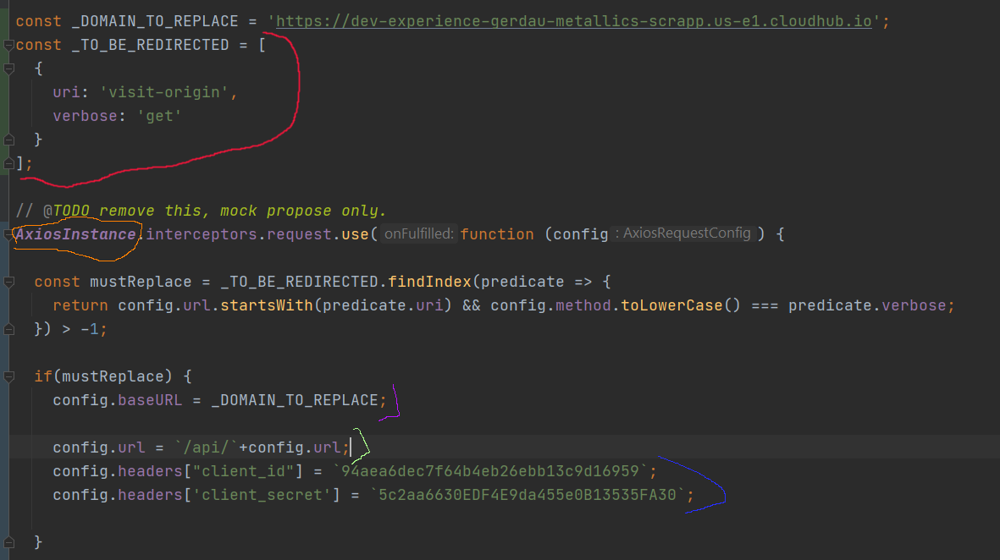

# Explicação técnica


## Código
Tanto no projeto WEB como no APP, todas as chamadas a api são realizadas através da biblioteca Axios, e a biblioteca tem um recurso para interceptação de requisições, onde podemos alterar configurações da requisição tais como cabeçalhos, conteúdo, url, etc etc. Nossa meta é desviar requisições selecionadas para o servidor **NOVO** assim garantindo que a aplicação continua funcionando. Abaixo segue uma imagem de código e respectivos comentários explicativos



- na parte vermelha temos a lista de "endpoints" que devem ser desviados para o **NOVO** servidor, levando em conta a URI e o VERBO HTTP
- realizamos uma verificação se a requisição que está sendo feita tem como destino uma URI e VERBO que estejam na lista
- Caso a verificação seja verdadeira, na parte roxa mudamos o domínio para o **NOVO** (https://dev-experience-gerdau-metallics-scrapp.us-e1.cloudhub.io), na parte verde agregamos o prefixo /api/ a URI existente, e na parte azul inserimos CLIENT_ID e CLIENT_SECRET que são requerimentos novos de segurança do servidor **NOVO**

Portanto com esse código conseguimos selecionar requisições que queremos destinar ao novo servidor, restando apenas listar as requisições desejadas e fazer anotações sobre. 

## Anotações
Para padronizar as anotações, cada XML deve ter um arquivo MARKDOWN criado na pasta XML/ e cada endpoint a ser testado deve seguir o seguinte template de anotações
```
#### VERBO:/URI

expected roles:
* ADMIN (uma lista das roles que a requisição é esperada a funcionar)
* AGENT

- [ ] expected response
- [ ] expected payload
- [ ] partial payload sent (ignore on GET)
- [ ] invalid payload sent (ignore on GET)
- [ ] partial URI parameters sent
- [ ] invalid URI parameters sent
- [ ] role operator
- [ ] role admin
- [ ] role buyer
- [ ] role agent
- [ ] role external
- [ ] role vendor
- [ ] role manager
notes
> as notas de problemas, sucesso ou sugestões.
```

#### Preview do template

#### get:/visit

expected roles:
* ADMIN 
* AGENT

- [ ] expected response
- [ ] expected payload
- [ ] partial payload sent (ignore on GET)
- [ ] invalid payload sent (ignore on GET)
- [ ] partial URI parameters sent
- [ ] invalid URI parameters sent
- [ ] role operator
- [ ] role admin
- [ ] role buyer
- [ ] role agent
- [ ] role external
- [ ] role vendor
- [ ] role manager

#####  notes

> as notas de problemas, sucesso ou sugestões.