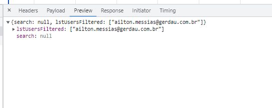
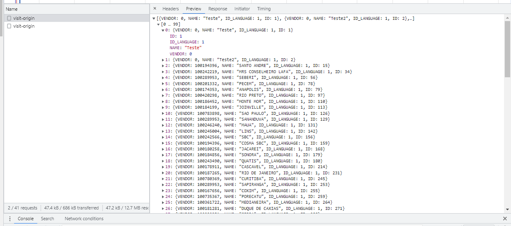

## Visit.xml

| status | em andamento |
|--------|--------------|


| endpoint                       | status                     | link                     |
|--------------------------------|----------------------------|--------------------------|
| post:/visit-web                | com problemas              | [aqui](#endpoint1) |
| post:/visit                    | com problemas              | [aqui](#endpoint2) |
| post:/visit-count-web          | com problemas              | [aqui](#endpoint3) |
| get:/visit-count               | com problemas              | [aqui](#endpoint4) |
| get:/visit                     | com problemas              | [aqui](#endpoint5) |
| put:/visit-shared-users        | com problemas              | [aqui](#endpoint6) |
| get:/visit-shared-users        | com problemas              | [aqui](#endpoint7) |
| get:/view-visit-users          | com problemas              | [aqui](#endpoint8) |
| put:/view-visit-users-regional | com problemas              | [aqui](#endpoint9) |
| post:/visit-type               | com problemas              | [aqui](#endpoint10) |
| post:/visit-definitive-sharing | com problemas              | [aqui](#endpoint11) |
| get:/visit-origin              | funcional, com observações | [aqui](#endpoint12) |


<br>
<br>
<br>
<br>

---
---
---

<br>
<br>
<br>
<br>


#### post:/visit-web <span id="endpoint1"><span>
- [ ] expected response
- [ ] expected payload
- [ ] partial payload sent (ignore on GET)
- [ ] invalid payload sent (ignore on GET)
- [ ] partial URI parameters sent
- [ ] invalid URI parameters sent
- [ ] role operator
- [ ] role admin
- [ ] role buyer

notes
> não foi possível testar, os payloads divergem muito




___

#### post:/visit <span id="endpoint2"><span>
- [ ] expected response
- [ ] expected payload
- [ ] partial payload sent (ignore on GET)
- [ ] invalid payload sent (ignore on GET)
- [ ] partial URI parameters sent
- [ ] invalid URI parameters sent
- [ ] role operator
- [ ] role admin
- [ ] role buyer

notes
> Não foi possível seguir os testes, ao tentar inserir uma visita é retornado um erro 500 com a mensagem 
```
"\"org.mule.weave.v2.exception.WriterExecutionException: java.lang.IllegalStateException - No read or write handler for lstVisits\njava.lang.IllegalStateException: No read or write handler for lstVisits\n\tat org.mule.weave.v2.module.pojo.reader.PropertyDefinition._type$lzycompute(PropertyDefinition.scala:44)\n\tat org.mule.weave.v2.module.pojo.reader.PropertyDefinition._type(PropertyDefinition.scala:35)\n\tat org.mule.weave.v2.module.pojo.reader.PropertyDefinition.classType(PropertyDefinition.scala:70)\n\tat org.mule.weave.v2.module.pojo.writer.entry.BeanPropertyEntry.entryType(BeanPropertyEntry.scala:24)\n\tat org.mule.weave.v2.module.pojo.writer.JavaWriter.topEntryTypeOption(JavaWriter.scala:168)\n\tat org.mule.weave.v2.module.pojo.writer.JavaWriter.calculateClass(JavaWriter.scala:114)\n\tat org.mule.weave.v2.module.pojo.writer.JavaWriter.doWriteValue(JavaWriter.scala:210)\n\tat org.mule.weave.v2.module.writer.WriterWithAttributes.internalWriteValue(WriterWithAttributes.scala:35)\n\tat org.mule.weave.v2.module.writer.WriterWithAttributes.internalWriteValue$(WriterWithAttributes.scala:34)\n\tat org.mule.weave.v2.module.pojo.writer.JavaWriter.internalWriteValue(JavaWriter.scala:44)\n\tat org.mule.weave.v2.module.writer.WriterWithAttributes.writeAttributesAndValue(WriterWithAttributes.scala:30)\n\tat org.mule.weave.v2.module.writer.WriterWithAttributes.writeAttributesAndValue$(WriterWithAttributes.scala:15)\n\tat org.mule.weave.v2.module.pojo.writer.JavaWriter.writeAttributesAndValue(JavaWriter.scala:44)\n\tat org.mule.weave.v2.module.pojo.writer.JavaWriter.doWriteValue(JavaWriter.scala:241)\n\tat org.mule.weave.v2.module.writer.Writer.writeValue(Writer.scala:65)\n\tat org.mule.weave.v2.module.writer.Writer.writeValue$(Writer.scala:46)\n\tat org.mule.weave.v2.module.pojo.writer.JavaWriter.writeValue(JavaWriter.scala:44)\n\tat org.mule.weave.v2.module.java.JavaInvocationHelper$.transformToJava(JavaInvokeFunction.scala:118)\n\tat org.mule.weave.v2.el.utils.DataTypeHelper$.transformToJava(DataTypeHelper.scala:168)\n\tat org.mule.weave.v2.el.utils.DataTypeHelper$.transformToJavaDataType(DataTypeHelper.scala:153)\n\tat org.mule.weave.v2.el.utils.DataTypeHelper$.toJavaValue(DataTypeHelper.scala:85)\n\tat org.mule.weave.v2.el.WeaveExpressionLanguageSession.evaluate(WeaveExpressionLanguageSession.scala:253)\n\tat org.mule.weave.v2.el.WeaveExpressionLanguageSession.$anonfun$evaluate$4(WeaveExpressionLanguageSession.scala:135)\n\tat org.mule.weave.v2.el.WeaveExpressionLanguageSession.doEvaluate(WeaveExpressionLanguageSession.scala:268)\n\tat org.mule.weave.v2.el.WeaveExpressionLanguageSession.evaluate(WeaveExpressionLanguageSession.scala:134)\n\tat org.mule.runtime.core.internal.el.dataweave.DataWeaveExpressionLanguageAdaptor$1.evaluate(DataWeaveExpressionLanguageAdaptor.java:321)\n\tat org.mule.runtime.core.internal.el.DefaultExpressionManagerSession.evaluate(DefaultExpressionManagerSession.java:117)\n\tat org.mule.runtime.core.privileged.util.attribute.ExpressionAttributeEvaluatorDelegate.resolveExpressionWithSession(ExpressionAttributeEvaluatorDelegate.java:68)\n\tat org.mule.runtime.core.privileged.util.attribute.ExpressionAttributeEvaluatorDelegate.resolve(ExpressionAttributeEvaluatorDelegate.java:56)\n\tat org.mule.runtime.core.privileged.util.AttributeEvaluator.resolveTypedValue(AttributeEvaluator.java:107)\n\tat org.mule.runtime.module.extension.internal.runtime.resolver.ExpressionValueResolver.resolveTypedValue(ExpressionValueResolver.java:115)\n\tat org.mule.runtime.module.extension.internal.runtime.resolver.ExpressionValueResolver.resolve(ExpressionValueResolver.java:99)\n\tat org.mule.runtime.module.extension.internal.runtime.resolver.TypeSafeValueResolverWrapper.lambda$initialise$0(TypeSafeValueResolverWrapper.java:64)\n\tat org.mule.runtime.module.extension.internal.runtime.resolver.TypeSafeValueResolverWrapper.resolve(TypeSafeValueResolverWrapper.java:52)\n\tat org.mule.runtime.module.extension.internal.runtime.resolver.TypeSafeExpressionValueResolver.resolve(TypeSafeExpressionValueResolver.java:66)\n\tat org.mule.runtime.module.extension.internal.runtime.resolver.ResolverUtils.resolveRecursively(ResolverUtils.java:92)\n\tat org.mule.runtime.module.extension.internal.runtime.resolver.ResolverSet.resolve(ResolverSet.java:107)\n\tat org.mule.runtime.module.extension.internal.runtime.operation.ComponentMessageProcessor.getResolutionResult(ComponentMessageProcessor.java:1260)\n\tat org.mule.runtime.module.extension.internal.runtime.operation.ComponentMessageProcessor.addContextToEvent(ComponentMessageProcessor.java:760)\n\tat org.mule.runtime.module.extension.internal.runtime.operation.ComponentMessageProcessor.lambda$null$5(ComponentMessageProcessor.java:354)\n\tat reactor.core.publisher.FluxMapFuseable$MapFuseableConditionalSubscriber.onNext(FluxMapFuseable.java:273)\n\tat reactor.core.publisher.FluxPeekFuseable$PeekFuseableConditionalSubscriber.onNext(FluxPeekFuseable.java:496)\n\tat org.mule.runtime.core.privileged.processor.chain.AbstractMessageProcessorChain$2.onNext(AbstractMessageProcessorChain.java:511)\n\tat org.mule.runtime.core.privileged.processor.chain.AbstractMessageProcessorChain$2.onNext(AbstractMessageProcessorChain.java:506)\n\tat reactor.core.publisher.FluxHide$SuppressFuseableSubscriber.onNext(FluxHide.java:127)\n\tat reactor.core.publisher.FluxPeekFuseable$PeekFuseableSubscriber.onNext(FluxPeekFuseable.java:204)\n\tat reactor.core.publisher.FluxOnAssembly$OnAssemblySubscriber.onNext(FluxOnAssembly.java:351)\n\tat reactor.core.publisher.FluxSubscribeOnValue$ScheduledScalar.run(FluxSubscribeOnValue.java:178)\n\tat reactor.core.scheduler.SchedulerTask.call(SchedulerTask.java:50)\n\tat reactor.core.scheduler.SchedulerTask.call(SchedulerTask.java:27)\n\tat java.util.concurrent.FutureTask.run(FutureTask.java:266)\n\tat org.mule.service.scheduler.internal.AbstractRunnableFutureDecorator.doRun(AbstractRunnableFutureDecorator.java:151)\n\tat org.mule.service.scheduler.internal.RunnableFutureDecorator.run(RunnableFutureDecorator.java:54)\n\tat java.util.concurrent.ThreadPoolExecutor.runWorker(ThreadPoolExecutor.java:1149)\n\tat java.util.concurrent.ThreadPoolExecutor$Worker.run(ThreadPoolExecutor.java:624)\n\tat java.lang.Thread.run(Thread.java:750, while writing Java at Body.\n\" evaluating expression: \"vars.Body\".:Payload empty - No data retrieved",
```


___

#### post:/visit-count-web <span id="endpoint3"><span>
- [ ] expected response
- [ ] expected payload
- [ ] partial payload sent (ignore on GET)
- [ ] invalid payload sent (ignore on GET)
- [ ] partial URI parameters sent
- [ ] invalid URI parameters sent
- [ ] role operator
- [ ] role admin
- [ ] role buyer

notes
> não foi possível testar, os payloads divergem muito


___

#### get:/visit-count <span id="endpoint4"><span>
- [ ] expected response
- [ ] expected payload
- [ ] partial payload sent (ignore on GET)
- [ ] invalid payload sent (ignore on GET)
- [ ] partial URI parameters sent
- [ ] invalid URI parameters sent
- [ ] role operator
- [ ] role admin
- [ ] role buyer

notes
> Não existem referências para este endpoint no web, comparando com o /visit-count-web mostra numeros diferentes e na API nova é retornado um erro (provavelmente de Java)


___

#### get:/visit <span id="endpoint5"><span>
não achei referência para ele
- [ ] expected response
- [ ] expected payload
- [ ] partial payload sent (ignore on GET)
- [ ] invalid payload sent (ignore on GET)
- [ ] partial URI parameters sent
- [ ] invalid URI parameters sent
- [ ] role operator
- [ ] role admin
- [ ] role buyer

notes
> não foi possível testar, na API nova retorna um erro de Java.


___

#### put:/visit-shared-users <span id="endpoint6"><span>
- [ ] expected response
- [ ] expected payload
- [ ] partial payload sent (ignore on GET)
- [ ] invalid payload sent (ignore on GET)
- [ ] partial URI parameters sent
- [ ] invalid URI parameters sent
- [ ] role operator
- [ ] role admin
- [ ] role buyer

notes
> não foi possível seguir os testes, a api nova gera um erro de Java


___

#### get:/visit-shared-users <span id="endpoint7"><span>
- [ ] expected response
- [ ] expected payload
- [ ] partial payload sent (ignore on GET)
- [ ] invalid payload sent (ignore on GET)
- [ ] partial URI parameters sent
- [ ] invalid URI parameters sent
- [ ] role operator
- [ ] role admin
- [ ] role buyer

notes
> Não foi possível seguir os testes, há uma rejeição do servidor dizendo que o método GET não é aceito


___

#### get:/view-visit-users <span id="endpoint8"><span>
- [ ] expected response
- [ ] expected payload
- [ ] partial payload sent (ignore on GET)
- [ ] invalid payload sent (ignore on GET)
- [ ] partial URI parameters sent
- [ ] invalid URI parameters sent
- [ ] role operator
- [ ] role admin
- [ ] role buyer

notes
> Não foi possível testar porque na api nova retorna erro 404


___

#### put:/view-visit-users-regional <span id="endpoint9"><span>
- [ ] expected response
- [ ] expected payload
- [ ] partial payload sent (ignore on GET)
- [ ] invalid payload sent (ignore on GET)
- [ ] partial URI parameters sent
- [ ] invalid URI parameters sent
- [ ] role operator
- [ ] role admin
- [ ] role buyer

notes
> Não foi possível seguir com os testes, não há referências em código para requisições a esse endpoint.


___

#### post:/visit-type <span id="endpoint10"><span>
- [ ] expected response
- [ ] expected payload
- [ ] partial payload sent (ignore on GET)
- [ ] invalid payload sent (ignore on GET)
- [ ] partial URI parameters sent
- [ ] invalid URI parameters sent
- [ ] role operator
- [ ] role admin
- [ ] role buyer

notes
> Não foi possível testar, o endpoint novo imprime algum erro de iteração (parece Java) e como detalhe mesmo com erro ,retorna status 200


___

#### post:/visit-definitive-sharing <span id="endpoint11"><span>
- [ ] expected response
- [ ] expected payload
- [ ] partial payload sent (ignore on GET)
- [ ] invalid payload sent (ignore on GET)
- [ ] partial URI parameters sent
- [ ] invalid URI parameters sent
- [ ] role operator
- [ ] role admin
- [ ] role buyer

notes
> Não foi possível seguir com os testes, não há referências em código para requisições a esse endpoint.


___

#### get:/visit-origin <span id="endpoint12"><span>
- [x] expected response
- [x] partial URI parameters sent
- [x] invalid URI parameters sent
- [ ] role operator
- [ ] role admin
- [ ] role buyer

notes
> o payload realmente é igual entretanto houve uma demora de 26.54 segundos no processamento da requisição, enquanto na API antiga o delay era de: 433 MS, e há uma diferença no tamanho em 17 Kbytes, pois na API antiga o json não é tabulado e identado, mas os payloads são idênticos.
 



